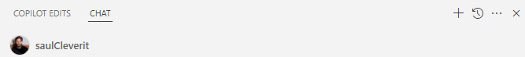
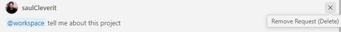

# Mejores Prácticas y Diseño de Prompts con GitHub Copilot

## 💫 Descripción General

GitHub Copilot es una herramienta de autocompletado de código impulsada por IA que ayuda a los desarrolladores a escribir código más rápido y con menos errores. Utiliza aprendizaje automático para sugerir fragmentos de código, funciones e incluso clases completas según el contexto del código que se está escribiendo. Este repositorio contiene mejores prácticas y técnicas de diseño de prompts para aprovechar al máximo GitHub Copilot.

## Diseño de Prompts para GitHub Copilot

### Comienza General y Luego Sé Específico

Al escribir prompts para GitHub Copilot, comienza con una descripción general de lo que deseas lograr y luego detalla los aspectos específicos. Esto ayuda al modelo a entender el contexto y generar sugerencias más relevantes.

Un ejemplo de un prompt general es:
Abre el Chat de GitHub Copilot y pregunta:

```plaintext
@workspace Quiero crear una función para actualizar el estado de una tarea. La función debe tomar un ID de tarea y un nuevo estado como parámetros y actualizar el estado de la tarea en la base de datos. Por ejemplo, si el ID de la tarea es 1 y el estado es "EN_PROGRESO", debe actualizar la tarea con ID 1 para que tenga el estado "EN_PROGRESO".
```

### Proporciona Ejemplos

Al pedirle a GitHub Copilot que genere código, proporciona ejemplos del tipo de entrada y salida que esperas. Esto ayuda al modelo a entender el formato y la estructura deseados del código.

Un ejemplo de un prompt que proporciona un ejemplo es:
Abre el Chat de GitHub Copilot y pregunta:

```plaintext
@workspace Quiero agregar una nueva funcionalidad para obtener tareas según su estado. La función debe tomar un parámetro de estado y devolver un arreglo de tareas que coincidan con ese estado. Por ejemplo, si el estado es "ABIERTA", debe devolver todas las tareas ABIERTAS. Entrada Esperada: { status: "ABIERTA" } Salida Esperada: [ { id: 1, title: "Tarea 1", status: "ABIERTA", "user": {"id": 1, "name": "Juan Pérez", "email": "juan.perez@example.com"}}, { id: 2, title: "Tarea 2", status: "ABIERTA", "user": {"id": 2, "name": "Ana López", "email": "ana.lopez@example.com"}} ]
```

Este prompt proporciona una descripción clara de la funcionalidad deseada, junto con un ejemplo de la entrada y salida esperadas. Esto ayuda a GitHub Copilot a entender lo que buscas y generar sugerencias de código relevantes.

### Divide Tareas Complejas en Tareas Simples

Cuando trabajes en tareas complejas, divídelas en tareas más pequeñas y manejables. Esto facilita que GitHub Copilot genere fragmentos de código relevantes y te ayuda a mantenerte enfocado en una tarea a la vez.

Un ejemplo de una tarea compleja es:
Abre el Chat de GitHub Copilot y pregunta:

```plaintext
@workspace Implementa una nueva funcionalidad para el sistema de asignación de tareas y notificaciones en la aplicación de gestión de proyectos. La funcionalidad debe permitir a los usuarios asignar tareas a miembros del equipo y enviar notificaciones cuando se asigne una tarea.
```

Este prompt es complejo y puede generar confusión. En su lugar, divídelo en tareas más pequeñas:

Abre el Chat de GitHub Copilot y pregunta:

1. **Asignación de Tareas**

```plaintext
@workspace Crea una función para asignar una tarea a un usuario. La función debe tomar un ID de tarea y un ID de usuario como parámetros y actualizar el usuario asignado a la tarea.
```

2. **Sistema de Notificaciones**

```plaintext
@workspace Crea una función para enviar una notificación cuando se asigne una tarea. La función debe tomar un ID de usuario y un ID de tarea como parámetros y enviar una notificación al usuario. Integra un servicio de notificaciones de terceros como SendGrid o Nodemailer para enviar la notificación.
```

3. **Pruebas**

```plaintext
@workspace Escribe pruebas unitarias para las funciones de asignación de tareas y notificaciones. Usa un framework de pruebas como Jest o Mocha para escribir las pruebas.
```

Este enfoque permite que GitHub Copilot se concentre en una tarea a la vez, facilitando la generación de fragmentos de código relevantes y sugerencias.

### Evita la Ambigüedad

Al escribir prompts, evita usar lenguaje ambiguo o descripciones vagas. Sé lo más específico posible sobre lo que deseas lograr. Esto ayuda a GitHub Copilot a generar sugerencias de código más precisas y relevantes.

Un ejemplo de un prompt ambiguo es:

Abre el Chat de GitHub Copilot y pregunta:

```plaintext
¿Qué hace esto?
```

Este prompt es ambiguo porque no especifica a qué se refiere "esto". En su lugar, proporciona un fragmento de código específico o el nombre de una función para aclarar tu solicitud.

Abre el archivo `userService.ts` o referencia el archivo en tu prompt usando la etiqueta #file. Luego pregunta:

```plaintext
¿Qué hace `createUser`? #file:userService.ts
```

Este prompt es más específico y proporciona contexto para que GitHub Copilot entienda lo que estás preguntando.

### Indica el Código Relevante

Al pedirle a GitHub Copilot que genere código, indica cualquier código relevante que deba considerarse. Esto ayuda al modelo a entender el contexto y generar sugerencias más relevantes.

#### Abre Archivos Relevantes

Abre archivos relevantes: Estos son los archivos directamente relacionados con la tarea en la que estás trabajando. Por ejemplo, si estás trabajando en una funcionalidad relacionada con la creación de usuarios, abre archivos como `user.controller.ts`, `user.service.ts` o `user.entity.ts`. Tener estos archivos abiertos le da a Copilot más contexto, ayudándolo a entender mejor tu base de código y proporcionar sugerencias precisas basadas en el código en esos archivos.

#### Cierra Archivos Irrelevantes

Cierra archivos irrelevantes: Estos son archivos que no están relacionados con la tarea actual. Por ejemplo, si estás trabajando en una funcionalidad de usuario, los archivos relacionados con componentes de la interfaz de usuario o servicios no relacionados pueden distraer a Copilot de ofrecer sugerencias útiles. Cerrar estos archivos permite que Copilot se concentre en el contexto relevante, lo que mejora la calidad de sus sugerencias.

#### Resalta Código

Resalta código: Para asegurarte de que Copilot Chat entienda el contexto de tu consulta, abre el archivo específico o resalta la sección de código que deseas que analice. Al usar la variable #selection para especificar el código resaltado, permites que Copilot Chat analice el contexto preciso, haciendo que sus sugerencias y respuestas sean más precisas y adaptadas a tus necesidades.

Un ejemplo de un prompt que resalta código es:

Abre el archivo `userService.ts` y resalta la función `createUserWithRole`. Luego pregunta a GitHub Copilot Chat:

```plaintext
@workspace /explain #selection ¿Qué hace esta función?
```

Este prompt proporciona un contexto claro para que GitHub Copilot entienda lo que estás preguntando. Al resaltar el código específico, aseguras que Copilot se concentre en la sección relevante y proporcione una explicación precisa.

#### Especifica Qué Archivos Referenciar

Especifica qué archivos referenciar: Puedes instruir a Copilot Chat para que se enfoque en archivos particulares de tu proyecto. Por ejemplo, en Visual Studio Code, puedes usar la variable #file para indicar un archivo específico o el participante @workspace para referenciar todos los archivos en el espacio de trabajo actual. Esto ayuda al chat a utilizar el contexto correcto, permitiéndole proporcionar una orientación más relevante basada en el código o archivo especificado.

Pregunta a GitHub Copilot Chat:

```plaintext
@workspace ¿Cuáles son las funciones principales en este archivo? #file:userService.ts
```

### Mantén el Historial Relevante

Copilot Chat utiliza el historial del chat para obtener contexto sobre tu solicitud. Para darle a Copilot solo el historial relevante:

Usa hilos para iniciar una nueva conversación para una nueva tarea.


Elimina solicitudes que ya no sean relevantes o que no hayan dado el resultado deseado.


